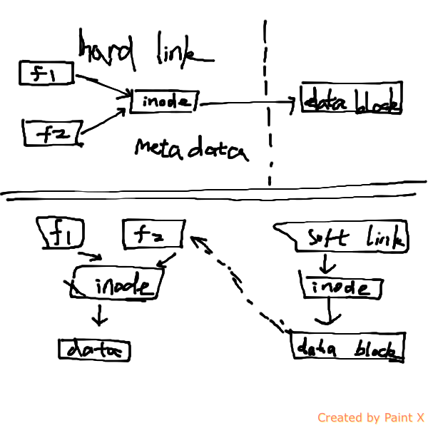

linux文件系统基于inode的内容， inode保存meta信息

+ inode (-不存文件名-)
  + size of file
  + device id
  + uid
  + gid
  + MODE
  + timestamps
  + pointer to data

+ 软连接，与硬连接有什么区别
	+ ln -s source dist # 软连接 文件用户数据块中存放的内容是另一文件的路径名的指向，则该文件就是软连接
	+ ln source dist # 硬连接 硬链接是有着相同 inode 号仅文件名不同的文件
+ 文件删除的条件
  + 文件有2个计数器，i_count（占有的进程数）, i_nlink（硬链接数），同时为0时删除文件

文件系统的层次结构如下：
文件系统中找到文件名，根据文件名找到inode号，根据inode号找到数据块
Filesystem -> filename -> inode -> data

inode的大小ext2 = 128字节
ext3

df -h
df -i 查看可用的inode号

ls -l
ls -i
stat file.txt
