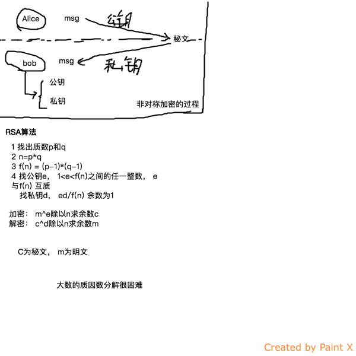

+ dig
  + 显示internet上13个根域服务器
  + dig @dnsserver name querytype


```
  用google的dns查询baidu的A记录
  dig @8.8.8.8 www.baidu.com A
```

nslookup用得少，dig用得多

RSA算法
+ 发报文时，公钥加密，私钥签名
+ 收报文时，私钥解密，公钥验签

+ 加密时，明文长度有限制，小于keySize/8 -11（byte）的字节长度
+ 明文过长时，采用分段加密
+ keySize一般等于1024bit（128字节），加密需要保留11字节，明文长度max为117（字节）
+ 无论加密时长度设置为多少，加密后每个segment长度都是固定为128字节，解密时segment—size为128字节

+ 同样的明文，同样的公钥，每次加密的结果不会一样。11字节都为随机数 填充使用
  + 填充协议PKCS #1 v1.5: "填充后数据" = "00" + "数据块类型" + "填充字符串" + "00" + "原始数据"
    + BT (数据块类型) 00: 填充字符串全为00；01：全为FF； 02:针对公钥时设置BT=02，伪随机字符串，这能解释上面公钥加密的结果会不一样；


非对称加密图例：


数字签名（私钥加密生成签名）
+ 确认消息来源
+ 确认消息完整性
