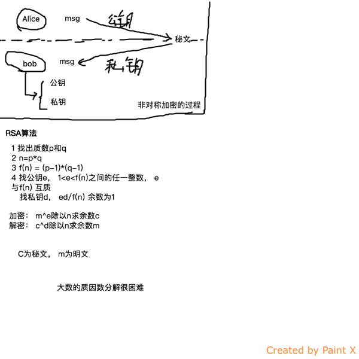

+ dig
  + 显示internet上13个根域服务器
  + dig @dnsserver name querytype


```
  用google的dns查询baidu的A记录
  dig @8.8.8.8 www.baidu.com A
```

nslookup用得少，dig用得多

RSA算法
+ 发报文时，公钥加密，私钥签名
+ 收报文时，私钥解密，公钥验签

非对称加密图例：

