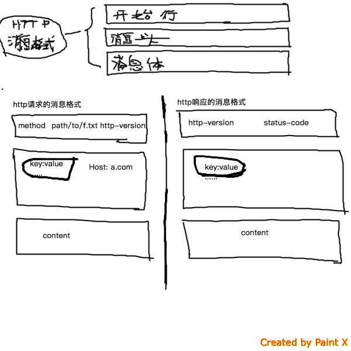
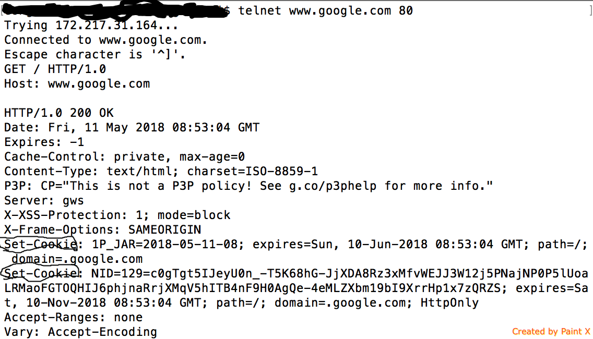
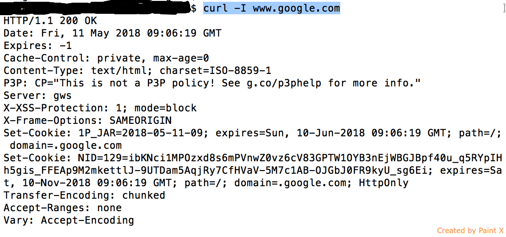

http数据包格式

http响应消息中的状态码
+ 1xx 接收的请求正在处理
+ 2XX 请求正常处理完毕
  + 200 OK
+ 3XX 重定向状态码
  + 301 Moved Permanently：永久重定向
  + 302 临时性重定向
+ 4XX 客户端错误状态码
  + 400 bad request
  + 401 Unauthorized
  + 403 Forbidden
  + 404 Not Found：表明服务器上无法找到请求的资源
+ 5XX 服务器错误状态码
  + 500 Interval Server Error
  + 503 Service Unavailable

----
session（服务器端）和cookie（客户端）让http协议有状态

服务器发送的响应报文header里的set-cookie字段的信息，客户端保存cookie信息

+ session
  + 记录跟踪用户的会话状态
  + 后端http会话的无状态实现
+ cookie
  + 保存用户的信息，存在于http数据包的头部header中
  + 是实现server端session的一种方式（如果客户端禁用了cookie， URL重写方式，url中传session id进行会话的跟踪）

+ 分布式session，4种实现方式
  + session复制
  + session仅指定一台server
  + session集中管理，redis存放
  + 基于cookie的方式

curl -I www.google.com
(curl -I 获取http响应的头部)

http请求与传送
+ curl
	+ X 指定request的method，如get，post
	+ H 指定请求的header
	+ d 消息体
	+ b 指定请求的cookie
	+ c set-cookie
	+ i reponse header
	+ w	 format output
+ wget 下载文件
post请求与get请求的区别
---
https = http + SSL/TLS

https 流程  涉及到 非对称加密 对称加密 hash算法 数字证书

+ https 握手阶段
+ https 传输阶段
  + 使用对称算法进行数据加密
