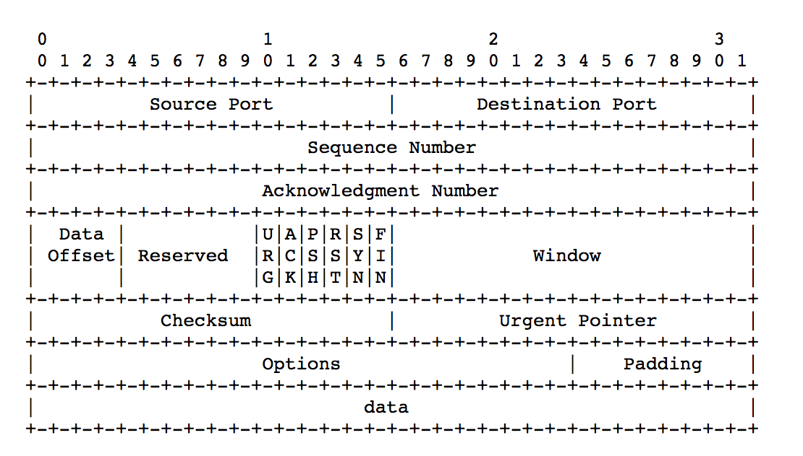
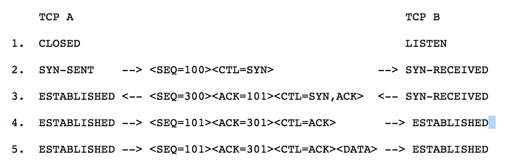
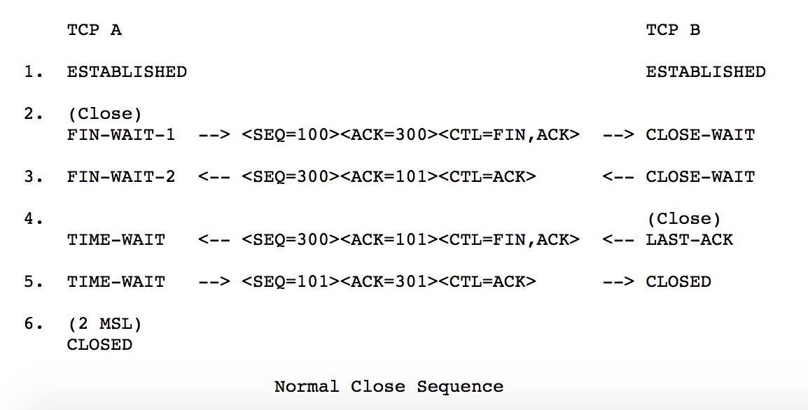

tcp报文结构图

+ URG: 表示紧急指针（urgent pointer）是否有效
+ PSH: 提示接收端应应该立即从TCP接收缓冲区中读走数据，为接收后续数据腾出空间
+ RST：复位报文段，表示要求对方重新建立连接
+ window：是TCP流量控制的一个手段， 告诉对方本端的TCP接收缓冲区还能容纳多少字节的数据，这样对方就可以控制发送数据的速度
+ checkSum: 校验数据包是否损坏

tcp握手与挥手过程图（基本图，实际中可以不是这样，例如关闭时双方同时发起关闭，双方都会到达time_wait状态）

⚠️
wireshake上的seq和ack number是relative number，0和1是为了方便查看，实际情况是其他数值

TIME-WAIT状态的理解：
+ 持续时间未2MSL，一个数据包在网络中的最长生存时间为MSL
+ 客户端回复的ACK丢失，服务器端会在超时时间到来时，重传最后一个FIN包
+ ACK和FIN在网络中的最长生存时间就为2MSL，这样就可以可靠的断开TCP的双向连接

---
TCP如何实现可靠传输（数据应答机制+数据超时重传）
+ 数据包都序列号，保证接收方能恢复数据包的顺序，去重等
+ 超时重传（确认和重传）， 也有快速重传，不用等待超时时间
  + 超时时间大于RTT（一次往返时间）
  + 每个被发送的数据包均有计时器，只有超过计时器的重传时间后，才会重发数据包

TCP如何实现流量控制
+ 当接受方处理不过来时，接受方缩小窗口，告知发送方
+ 以字节为单位的滑动窗口技术
  + recv的窗口大小决定sender的窗口大小（窗口以字节为单位）
  + sender缓存中的数据包必须收到recv的确认数据包后才能删除
+ 当接收方来不及处理发送方的数据，能提示发送方降低发送的速率，防止包丢失

TCP如何实现拥塞控制
+ 当网络拥塞时，动态改变发送窗口大小，减少数据的发送
