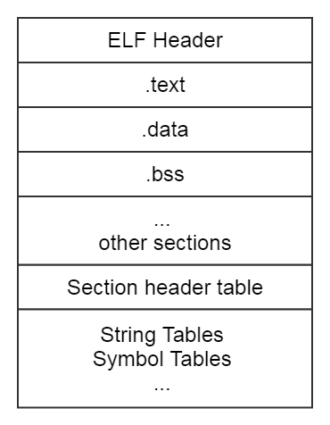

elf格式的文件
+ core dump file
+ 可执行文件
+ 共享文件
+ 重定向文件

从linker的角度看elf文件 （sections like .text,.data, .bss,...）

从exec的角度看elf文件

段的大小为64k，段基址代表程序在内存的起始，偏移地址代表段内偏移量

sections 与 segments的区别
section: 节，让程序员在逻辑上将程序划分为几个部分

readelf看elf文件的头
elf头记录地址，大小等记录  

.bss段不存在程序文件中，仅存在与内存中

存放为初始化的全局变量和局部静态变量。
目的是为这些为初始化的数据项预留内存空间
bss中的实际内容在程序运行时才产生，起初并无意义

中断向量表

段基址 段内偏移量

----
cpu 寻址方式
寻址： 指令中操作数所在的真实位置，cpu怎么去找指令中的数据

七种
+ 立即数寻址（不用寻址）
+ 寄存器寻址 （操作数存在了寄存器里，不用到内存寻址）
+ 直接寻址 （直接给出操作数的内存地址）
+ 寄存器间接寻址 （操作数的地址在寄存器，操作数在内存中）
+ 寄存器相对寻址 （寄存器的内容+给定的位移量之和等于操作数的内存地址）
+ 基址加变址寻址 （基址寄存器+变址寄存器内存之和等于操作数的内存地址）
+ 相对基址变址寻址 （基址寄存器+变址寄存器+给定的位移量等于操作数的内存地址）
----
