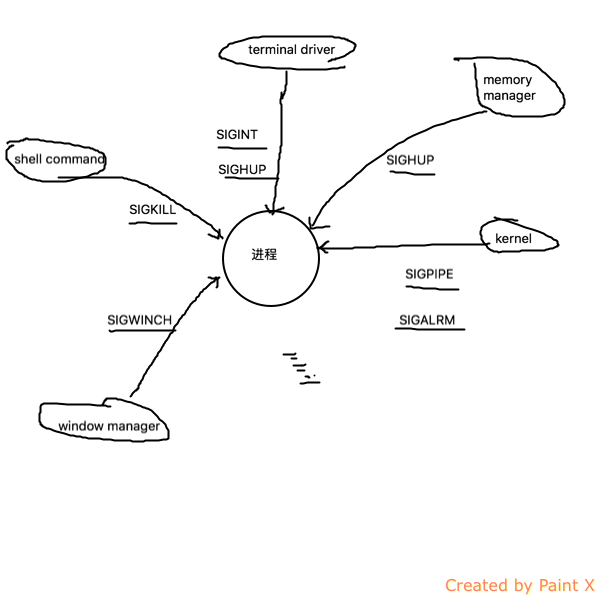

task_struct结构体对应与进程相关的信息

可执行文件的结构 （size查看）

进程的内存结构
进程的uid，euid，suid。
euid是为了控制访问资源的
euid一般与uid保持一致，当执行二进制程序时，若程序设置了setuid, 那么进程的euid更改为程序的宿主uid
/usr/bin/passwd

进程控制块PCB
+ 进程状态，运行，或者等待。。
+ 进程号
+ PC指针
+ 栈指针
+ CPU寄存器信息
+ 内存信息
+ 打开的文件
+ 所有者用户
+ 状态队列指针 （OS用进程状态队列去管理进程以及PCB， 就绪队列， 阻塞队列等等）
+ 。。。。

进程的页目录表 第0-767个页目录项属于用户空间，指向用户页表； 768-1023指向内核页表；表中最后一项为用户进程的页目录表的物理地址

进程上下文切换 context switch
+ 保存运行进程到上一个进程的PCB， 加载下一个进程的PCB

创建进程 fork 子进程从父进程上继承了哪些内容？

pstree命令显示整个进程树

pid=1的进程为init进程，其他所有进程最开始均是通过init进程的fork来创建的

fork+exec 创建子进程，执行新程序
+ 在shell中vim， shell进程会去fork和exec vim。

进程通信：

信号signals：

+ SIGALRM:  timer time out
+ SIGABRT： 丢弃执行进程
+ SIGHUP： 挂起
+ SIGINT: 进程中断， ctrl+C可以产生
+ SIGKILL: 杀死进程， kill -9 pid， 不能忽略
+ SIGTERM: 进程终止， kill pid
+ SIGPIPE: 非法写管道
+ SIGQUIT： 进程退出，ctrl+\
+ SIGSTOP: 终止进程， 不能忽略
+ SIGTSTP: 终止进程， ctrl+z
+ SIGCHLD: 当子进程退出时，发送给父进程的信号
+ SIGSEGV: 段错误
+ 用户自定义信号

kill -l 显示可用的信号

信号的来源图

---

进程退出
+ exit系统调用
+ kill

僵尸进程：子进程退出，父进程没有调用wait，waitpid获取子进程的状态信息，那么子进程的pid仍然保留在系统中，称为zombie

孤儿进程：父进程退出，子进程还在运行，子进程为孤儿进程，被pid=1的init进程收养

进程协作
生产者进程与消费者进程， 通过共享数据结构进行协作
