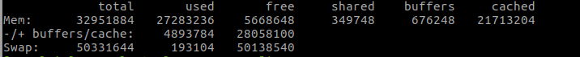

free查看内存使用情况，包含已用内存，可用内存，交换内存的情况，默认以字节为单位( 简单版的top命令 )

---
free -t (total, 有汇总行)
+ total = used + free
+ used 包含cached， buffers， shared部分
+ -buffers/cache: used-buffers-cached (可以看出程序吃掉的内存)
+ +buffers/cache: free+buffers+cached （可以挪用的内存）
---
free命令后的buffer与cached的区别
+ buffer缓冲,内存写硬盘时的写缓冲内存
+ cached缓存,数据缓存，读缓存
+ cpu-->cache -->mem --> buffer --> disk
+ 交换区swap与内存mem的区别：当mem不够用时，使用swap存放不常用的数据, 把磁盘当做虚拟内存使用
    + 清理swap， swapoff -a && swapon -a

---

iostat: 显示磁盘读写速度状态
vmstat: 显示整体的虚拟内存状态（调页paging，交换swapping）
netstat：显示网络状态

Procs 进程
+ r：运行的进程数
+ b：等待的进程数

Memory
+ swpd： 使用的虚拟内存大小
+ free： 空闲内存
+ buf： 缓冲内存大小
+ cache： 缓存内存大小

Swap
+ si 每秒从交换区到内存的大小， 磁盘-》内存
+ so 每秒从内存到交换区的大小， 内存-》磁盘

io
+ bi 每秒读的块数
+ bo 每秒写的块数

system
+ in: 每秒中断数
+ cs: 每秒上下文切换数

CPU
+ us 用户进程执行时间占比
+ sy 内核进程执行时间占比
+ wa 等待IO时间占比
+ id 空闲时间占比
