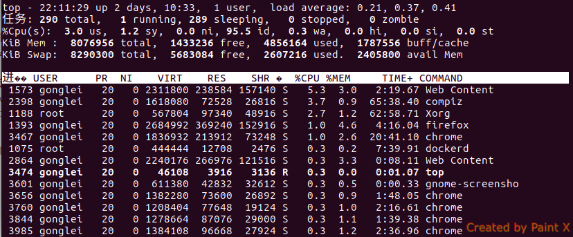

linux top命令（mac top结果显示有一些区别）

+ Linux下常用的性能分析工具，可以通过按键进行交互显示
+ 能够实时显示系统中各个进程的资源占用状况,类似windows下的任务管理器
---
以ubuntu top命令结果为2类信息(中间由一个空行分开)

+ 5行统计信息
  + 任务队列信息，uptime命令的结果类似
    + load average: 1分钟，5分钟，15分钟内的系统平均负荷
  + 进程统计信息
    + 系统中一共由290个进程，running状态为1个，休眠状态为289个， stopped状态和zombie状态为0
  + CPU状态
    + 3.0 us：用户程序占用cpu的比例3.0%
    + 1.2 sy：内核程序占用cpu的比例1.2%
    + 0.0 ni：改变过优先级的进程占用CPU的百分比
    + 95.5 id：空闲CPU百分比95.5%
    + 0.3 wa：IO等待占用CPU的百分比0.3%
    + 0.0 hi：硬中断（Hardware IRQ）占用CPU的百分比0.0%
    + 0.0 st：软中断（Software Interrupts）占用CPU的百分比0.0%
  + 内存信息
    + total： 8G空间
    + free： 空余1433236kb
    + used： 使用4856164kb
    + buff/cache：主存上缓存大小1787556kb
  + swap交换区信息（虚拟内存，在磁盘上）
    + total： 交换区总量为8G多
    + cached： 交换区上缓冲的大小

+ 各进程的状态监控信息
  + 进程pid， 拥有者user， 进程优先级PR， NI nice值
  + VIRT（占有的虚拟内存总量kb，virt=swap+res）， RES（内存res=code+data），SHR（共享内存）
  + 进程状态（D不能中断的睡眠， R运行， S睡眠，T跟踪/停止， Z僵尸）
  + %CPU（占cpu百分比），%MEM（占内存百分比）， TIME（进程使用cpu的时间，单位1/100秒）， COMMAND（进程名称）

---
硬中断与软中断
+ 由外设(网卡，磁盘，键盘，时钟)产生，比如网卡收到数据包，网卡发出硬中断，数据由DMA写内存
+ 软中断，指令int， 比如系统调用，只有运行的程序才可以产生软中断
