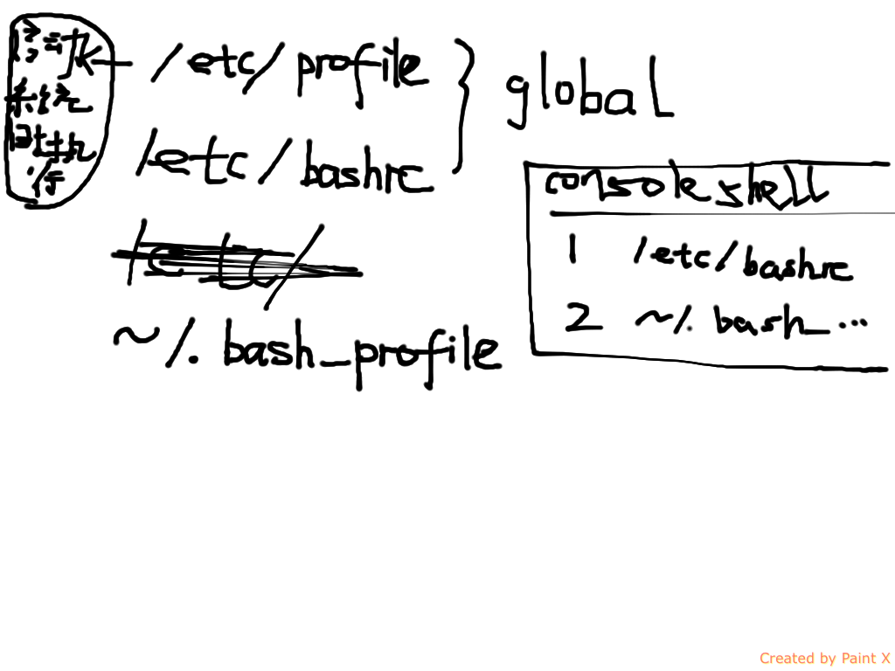

+ 进入终端全屏
	+ ctrl + alt + f1
	+ ctrl + alt + f2
	+  ...
	+ ctrl + alt + f6
+ 推出终端全屏
	+ ctrl + alt + f7
+ 进入，退出终端全屏
	+ ctrl + alt + f7
+ 打开终端
	+ ctrl + alt + t
+ terminal
	+ 分屏	同时看多台服务器上的日志

-----
+ /etc/profile
	+ 为系统中每个用户设置环境信息，只在用户第一次登陆时，被执行
	+ 并从/etc/profile.d目录中搜索shell的配置
+ /etc/bashrc
	+ bash shell被打开，就被执行
+ ～/.bashrc
	+ 每次打开shell时，被执行
+ ~/.bash_profile
	+ 用户登陆时仅执行一次，执行用户的bashrc

-----

+ getconf PAGE_SIZE
	+ 4096
+ getconf PAGESIZE

#learn vim

+ ~/.vimrc
+ .bashrc
+ bundle
+ vimscript

+ 查找某个字符串
  + 命令模式:／strings
+ 在整个文件中替换特定字符串
  + :%s/old_word/new_word/g
  + g/old_word/s//new_word/g
active and inactive list LRU
grep -i active /proc/meminfo